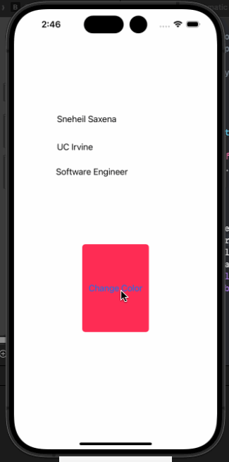

## IOS Prework
**App:** Random Color Button App  
**Submitted by:** Sneheil Saxena

## Time Spent
I spent approximately 2 hours completing this prework.

## Required Features
- Three UILabels displaying my name, university, and career goal.
- One UIButton that, when tapped, changes the background to a random semi-transparent color.

## Video Walkthrough

## App Brainstorming

### Favorite Apps & Key Features
1. **Instagram** – Clean, scrollable feed; intuitive camera interface; seamless media upload.
2. **Spotify** – Personalized playlists; smooth audio streaming; smart recommendations.
3. **Duolingo** – Gamified lessons; progress tracking; bite-sized exercises.

### My App Idea
I’d love to build a video game similar to some RPGs like Undertale with lots of unique characters, music, levels, different types of gameplay, and 

## How to Run
1. Clone this repo.  
2. Open `codepath_prework.xcodeproj` in Xcode.  
3. Build and run on an iOS Simulator.
